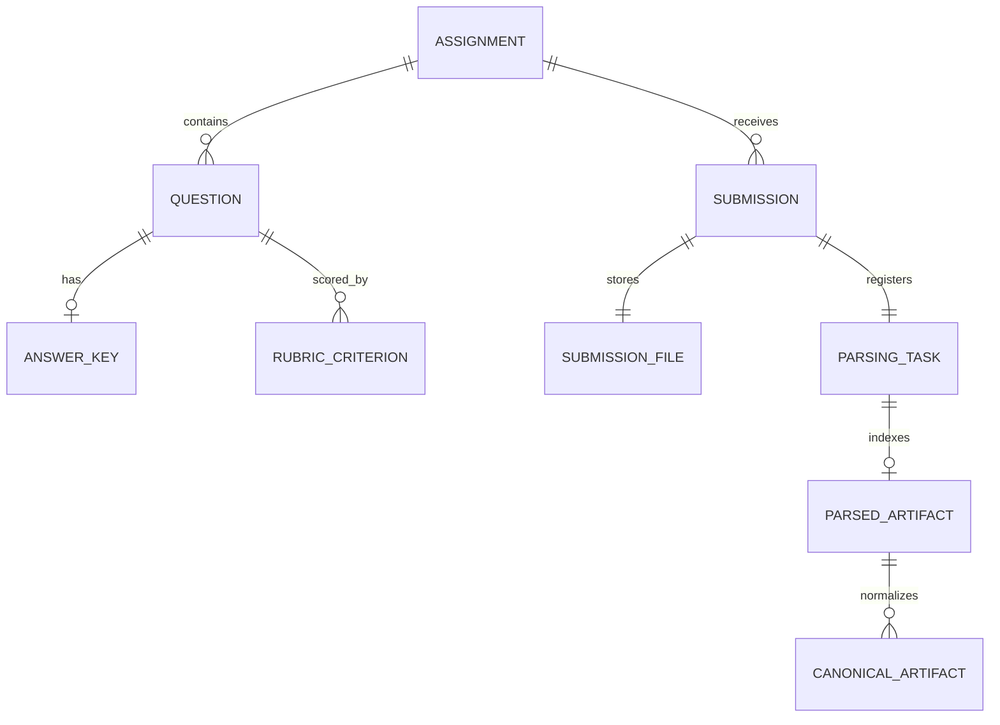

# 架构与模块边界

慧批云端采用 src 布局的模块化单体。P1-A、P1-B、P2-A 已合并到 `main`；P2-B 的实现与验收记录见 PR #5。自动批改、题目结构化、用户权限仍未实现。

## 模块职责

- `api/v1`：HTTP 路由、请求校验、响应结构和错误码。
- `core`：环境配置和日志。
- `modules/assignments`：作业、题目、人工答案、评分细则和发布校验。
- `modules/submissions`：模拟学生标识校验、文件检查、提交编排、提交查询和原始文件元数据。
- `modules/parsing`：解析任务状态、状态迁移规则、PostgreSQL repository、解析产物索引、错误分类、重试时间策略、状态查询 Schema 与 ParserExecutor 协议。
- `modules/canonical_documents`：Canonical Document v1 DTO、MiddleJson 适配转换、有界内容验证、稳定标识、S3/PG 持久化、状态与页面查询。
- `workers`：独立于 FastAPI 的解析任务轮询进程，管理领取、解析调用、heartbeat、结果提交和受控退出；另含受控规范化 CLI。
- `infrastructure/database`：共享 Engine 工厂与按请求/操作创建的 AsyncSession；Alembic 管理结构，应用启动不会调用 `create_all`。
- `infrastructure/storage`：boto3 S3 兼容适配器。本地对象存储使用 PGSTY SILO。
- `infrastructure/parsing`：隔离的 MinerU 4.x 子进程启动、PDF 预检、输出归档校验和不可变解析产物上传。
- `migrations`：按版本演进的 PostgreSQL Schema。

路由负责 HTTP 输入输出；领域服务组织用例；Repository 负责具体数据库查询。当前没有通用 Repository 框架、微服务、Celery、RabbitMQ 或 Redis。

## 数据关系



同一 `Submission` 有一份 `SubmissionFile` 元数据与唯一的 `ParsingTask`。提交、对象定位信息和初始 `pending` 任务在一个 PostgreSQL 事务内写入。原文件放在私有 S3 兼容存储，数据库只保存 bucket、服务端生成的 `object_key`、MIME、大小和 SHA-256。

解析成功后，`ParsedArtifact` 在 PostgreSQL 记录解析器版本、模型档位、MiddleJson schema 版本、页数、摘要和产物对象 Key。每个 ParsingTask 和 Submission 最多有一条索引记录。Markdown、MiddleJson、StructuredContent、原始 ZIP、素材文件和素材 manifest 放在同一私有 S3 兼容存储；数据库不保存大块解析正文。成功状态与产物索引由一个带当前 lease token 的数据库事务提交。

## Canonical Document 标准化

P2-C 通过独立的 `huipi.canonical.document` 1.0 协议，把 P2-B 已成功并带有 SHA-256 索引的 MinerU 4.x MiddleJson 2.0 转换成 `Document → Page → Block`。Canonical DTO 不继承 MinerU 类，也不修改或覆盖 MiddleJson、StructuredContent、Markdown 或原始归档。转换器只接受已知的 P2-B MiddleJson 字段类型；未知 Block/Span 类型、错误页索引、异常 BBox、坏素材路径、重复 JSON 键、过深或过大的输入会返回固定安全错误码。

页面顶层 Block 有稳定 UUIDv5、原始页索引和 Block index，以及文档级连续 `reading_order`。`page_index`、`source_page_idx` 从 0 开始，展示 `page_number` 从 1 开始。页和 Block 都按输入数组顺序保留，不按坐标重排，不对相同位置的 Block 去重。页级未识别字段保存在 `CanonicalPage.source_fields`；实际 MinerU 4.0.10 输出页只有 `page_idx` 和 `blocks`，因此该字段为空。Document 保留源 MiddleJson 的全部非页面顶层 metadata、extensions、schema 和全篇标记。嵌套 Block/Span 保存在父 Block 的递归内容树中，保留类型、可用的原始 index、字段和子元素顺序；`equation_inline` 作为 formula 节点保存原始公式字符串，不拼进普通文本。table 节点保留原始 HTML 或子节点树。header/footer、标题、页码、脚注、索引和引用文字映射为 layout，并保留原始 `source_type`。

Block 的 `normalized_type` 表示业务类型，`source_type` 表示 MinerU 原始类型。非文本字段留在版本化 `source_fields`；`source_payload_schema_version` 固定说明这些来源字段的保存规则。`image_base64` 和 data URI 不复制进 Canonical JSON：转换器保留解码后二进制的 SHA-256、字节数、媒体类型、MiddleJson JSON Pointer 和编码类型，并将其表示成脱敏引用。通过 `source_artifact_id` 可定位 P2-B 的不可变 MiddleJson；恢复函数会先校验整份源文件摘要，再验证图像字节的摘要、大小和类型。单张内嵌图像上限为 16 MiB。

MiddleJson BBox 只有在 P2-B 的 MinerU 4.x 合同中为四个 `[0,1]` 数值时才保存；`bbox_coordinate_space=normalized_page_ratio_0_to_1` 表明这是页比例坐标，不是 PDF 物理像素，也不会再归一化或推算缺失 BBox。坐标轴顺序沿用源 `[x0,y0,x1,y1]`。缺失 BBox 保持 `null`。

Canonical `assets` 数组保留完整且通过校验的 P2-B manifest，包括未被任何 Block 引用的合法素材；Block 引用只指向对应的逻辑 asset id。Canonical DTO 不保存 S3 `object_key`、bucket 或凭据。每个逻辑 asset id 是按来源 artifact、素材路径和摘要生成的 UUIDv5。相对路径只解码一次，拒绝绝对路径、路径穿越、反斜线和非法编码；缺失 manifest 引用或对象会使标准化失败。HTTP(S) 图片链接作为外部引用原样记录但不发起网络请求。内嵌 data URI/Base64 不复制进 Canonical JSON；引用保留二进制摘要、解码后大小、媒体类型和指向 MiddleJson 的 JSON Pointer。通过 Canonical 的 `source_artifact_id` 找到原始 MiddleJson，并按该 Pointer 和 SHA-256 校验后可恢复图像字节。单个内嵌图片限制为 16 MiB。

规范化有 MiddleJson、manifest 和 Canonical JSON 字节上限、最大节点数、最大嵌套深度。页面 API 的 Canonical JSON 大小默认上限为 32 MiB，并由配置强制不超过 64 MiB。API 在下载前检查 PostgreSQL 索引的字节数，再分块读入有界缓冲并验证完整 SHA-256；随后由 Pydantic 校验整份结构，再只返回请求页。它不再额外复制完整 JSON bytearray，但 Pydantic 仍会创建文档对象，所以内存峰值会高于对象字节数；并发请求会叠加内存。本接口仍只适用于本地或受控环境。对象超限、损坏、JSON 结构异常和对象存储故障都返回安全的 503，不向响应暴露 Key 或内部异常。JSON 序列化采用 UTF-8、紧凑分隔符、键排序和拒绝非有限数值。相同来源 artifact 和 normalizer 版本生成相同的文档/Block/asset ID 与 Canonical 字节；JSON 中没有每次运行变化的时间戳。Block 数只统计 Page 下的顶层 CanonicalBlock，嵌套内容节点不计入 Block 数。

规范化由 `python -m huipi_cloud.workers.normalize_document --submission-id UUID` 单独执行。CLI 只读取 `succeeded` ParsingTask 对应的 ParsedArtifact，分块读取 MiddleJson 和 assets manifest，先验证数据库记录的大小与 SHA-256，再验证结构、素材引用和素材对象长度。失败只写 Canonical 的 `failed` marker，不修改 P2-B ParsingTask 的成功状态。成功时先向 S3 上传每次执行独有且不可变的 `canonical/.../runs/{uuid}/canonical.json`，然后在 PostgreSQL 以 `(parsed_artifact_id, normalizer_version)` 唯一约束登记轻量索引。并发成功最多产生一条有效索引；并发输家对象可能成为孤儿。若数据库提交错误或 COMMIT 结果不确定，不删除 Canonical 对象，避免误删可能已被引用的对象。当前没有孤儿对象清理器，未来应按保留期与 PostgreSQL 有效索引对账。

`GET /api/v1/submissions/{submission_id}/canonical-document` 只返回规范化状态、来源和校验摘要。缺少成功结果返回 `not_generated`；确定性失败返回 `failed` 和安全 failure code；成功返回 `available` 和元数据。`GET /api/v1/submissions/{submission_id}/canonical-document/pages/{page_number}` 按 1 起始页码读取受限大小对象，验证整个 Canonical JSON SHA-256 和索引关系，再只返回请求页。未生成或失败返回 409，不存在的提交或页码返回 404；对象存储或 Canonical 完整性故障返回安全的 503。API 不返回 S3 Key，也不返回完整文档摘要以外的大对象。

这两个接口目前没有登录、RBAC、归属验证或租户隔离，只能用于本地或受控环境。Canonical 只把文档结构稳定化；题目识别、答案对齐、自动批改和人工复核尚未实现。

## 任务状态与执行边界

允许的主要状态迁移：

```text
pending ──claim──> running ──success──> succeeded
                       ├──temporary failure──> retry_wait ──due claim──> running
                       └──permanent/exhausted──> failed
```

`running` 任务的 `lease_token` 与 `lease_expires_at` 必须同时存在；其他状态不得保留 lease。`retry_wait` 必须有 `next_run_at`。成功和最终失败必须有 `finished_at`。数据库约束防止不合法字段组合；Service/Repository 根据错误类型、尝试次数和当前 lease 选择合法迁移。

`claim_next_task()` 在短事务中先用 `FOR UPDATE SKIP LOCKED` 选出最早的到期任务，生成唯一 token 并增加尝试次数。数据库在写入领取状态时用 `clock_timestamp()` 计算新 lease 截止时间，因此扫描和锁定工作不会提前消耗大部分租约。事务提交后行锁释放；Parser 执行在事务之外。长任务按 heartbeat 间隔续租。完成和续租使用带 token、状态和数据库当前时间条件的 `UPDATE`。失败也在一个条件 `UPDATE` 中检查租约并按尝试次数选择重试状态。PostgreSQL 在 `READ COMMITTED` 下等待行锁后会重新检查 `UPDATE` 的条件；条件中的 `clock_timestamp()` 在更新时判断，不会使用锁等待前读到的旧时间。过期任务可由后续 Worker 领取；过期且达到上限的任务以固定安全错误摘要转为 `failed`。

每次领取、续租、完成或失败更新都创建独立 AsyncSession。请求期间不共享 Session 实例。Engine/Session 工厂是进程级资源；SQLAlchemy Session 不跨请求或 Worker 操作共享。Repository 使用上下文管理器提交或回滚事务，并关闭 Session。租约判断默认使用 PostgreSQL `clock_timestamp()`，所有 Worker 共享数据库时钟；测试可显式注入固定 UTC 时间。

重试错误使用数据库保存的 `next_run_at` 和有上限的指数退避，不在 Worker 中长时间等待某一任务。执行模型是 At Least Once。lease 只能围住 PostgreSQL 状态提交，不能撤销过期 Worker 已经产生的外部副作用；未来解析产物必须按任务或提交版本幂等写入。

Worker CLI 要求 `PARSING_EXECUTOR=module.path:factory`，否则拒绝启动。当前生产工厂为 `huipi_cloud.infrastructure.parsing.mineru:build_mineru_executor`。ParserExecutor 接收不可变的任务与原文件元数据，返回经过校验的 `ParsedArtifactResult`；不能用 `None` 表示成功。测试 Fake executor 只用于验证状态框架，另有 opt-in 测试运行真实 MinerU。

真实执行器只支持 MinerU 4.x Basic/ONNX 本地模型。模型与 CLI 不进入应用 `uv.lock`；部署者需单独安装，配置 `MINERU_EXECUTABLE` 和 `MINERU_HOME`。启动时先验证 CLI 版本和模型。Worker 下载原文件时分块写入权限为 `0700` 的临时目录，复核数据库记录的大小和 SHA-256，再由 `pypdf` 检查 PDF 可读性、加密状态和页数。

MinerU 运行在新 session 的 Linux 子进程组中。输入命令使用参数数组，不经 shell；子进程只收到模型路径和必要运行参数，不继承数据库 URL 或 MinIO 密钥，`HOME` 和临时目录指向每次任务的私有临时目录。输出被持续排空但日志内容不写入应用日志；Worker 监测超时和临时目录占用，超出限制时按 TERM、短宽限、KILL 的顺序结束进程组，并在有界时间内等待进程组消失。若直接子进程无法回收或后代进程仍存活，执行器报致命错误，由 Worker 故障退出，交由租约恢复任务。这个 `os._exit` fail-stop 不执行 Python 的临时目录清理；部署环境需清理由崩溃留下的 `huipi-mineru-*` 工作目录。父进程死亡时，隔离 guard 用 `PR_SET_PDEATHSIG` 清理同组子进程。此机制依赖 Linux，不能终止主机掉电前已发出的外部副作用，也不能保证内核故障时立刻回收。它是进程生命周期管理，不是 OS 安全沙箱；子进程仍以 Worker 的 OS 用户运行，部署时需要用低权限、专用的 Worker 用户和文件权限限制解析风险。

输出 ZIP 会在解压前检查成员数、重复路径、绝对路径、`..`、反斜杠和解压总大小。执行器要求 `markdown.md`、`middle_json.json`、`structured_content.json`，并校验 MinerU 4.x Basic 输出合同：MiddleJson schema/version、metadata/producer/extension 类型、PDF 源格式、页面与 block 结构、零基连续页索引及 StructuredContent 对应页索引和 block 类型。确定的合同错误转换成固定 `invalid_result` 永久错误，不将 JSON 或堆栈暴露给 API。

图片引用按 MinerU 4.x 的 `image_path`/`img_path`、StructuredContent 的 `image_source`、视觉 block 的 HTML `img src` 和 Markdown 图片语法读取；普通 Markdown 超链接不按图片处理。相对路径在一次 URL 解码后规范化，绝对路径、反斜杠、控制字符和 `..` 路径拒绝。引用必须匹配 ZIP 中支持的图片素材；HTTP(S) 和 `data:image` 引用不发起网络请求。素材可位于任意安全相对目录，`images/{relative_path}` 作为兼容候选路径。配置限制包括最大输入字节数、PDF 页数、归档/展开字节数、单个文本输出字节数和 ZIP 成员数。

任务输入保存提交时的 bucket 与 object key。当前是单桶适配器，Worker 在下载前要求 `ParsingInput.bucket == S3ObjectStorage.bucket`；配置切换后，旧 bucket 任务以 `storage_bucket_mismatch` 永久失败，不会从新桶读取同名 Key。ParsedArtifact 的 bucket 来自执行器实际使用的同一 S3 适配器。迁移对象时必须先做显式存储迁移并更新元数据；本阶段没有多桶客户端路由。

结果对象 Key 使用服务端生成的运行 UUID，形如 `parsed/{submission_id}/tasks/{task_id}/runs/{artifact_id}/...`；如果配置了测试前缀，该前缀会置于 `parsed/` 之前。每个尝试使用新前缀，避免旧 Worker 覆盖新运行的输出。它提供不可变运行隔离，但不构成幂等去重。数据库成功事务失败或进程在对象写入后退出时可能留有孤立对象，当前没有自动清理或对账任务。

查询 `GET /api/v1/submissions/{submission_id}/parsed-document` 返回状态、解析器来源和校验和，不暴露对象 Key。`GET /api/v1/submissions/{submission_id}/parsed-document/markdown` 从私有存储流式传回 Markdown；当前未实现解析资产读取 API。

## 上传和对象一致性

上传时先校验作业、文件名、文件大小、扩展名、声明类型和文件签名，分块读取文件并计算 SHA-256，再将对象写入私有存储。随后在 PostgreSQL 事务内锁定并复核作业状态、写入 `Submission`、`SubmissionFile` 和 `ParsingTask(pending)`。若上传失败，不写提交记录；若数据库事务失败，会尝试删除已上传对象。数据库与对象存储没有共享事务，因此进程崩溃或 COMMIT 结果不确定仍可能留下孤立对象。未来应定期对账清理。

## 安全与可用性边界

`student_ref` 不是认证身份。作业提交、文件下载、任务状态和解析结果查询没有登录、RBAC、归属校验或租户隔离，只能在本地或受控环境使用。任务状态 API 不返回 `lease_token`、对象 Key、文件内容、堆栈或原始异常信息；解析摘要也不返回 bucket 和私有对象 Key。执行错误只保存固定的错误码和短摘要。`GET /api/v1/health` 是存活探针，不检查 PostgreSQL 或对象存储就绪状态。数据库/对象存储连接故障由 API 返回不含内部凭据的安全响应。

## 并发与故障语义

PostgreSQL 是当前任务队列。行锁与 `SKIP LOCKED` 避免 Worker 等待同一行；lease token 和条件更新让旧 Worker 无法覆盖新执行的状态。租约到期不证明旧进程已停止，因此系统不承诺 Exactly Once。Worker 在 SIGINT/SIGTERM 后停止领取任务，并在 `PARSING_SHUTDOWN_GRACE_SECONDS` 内等待当前执行。之后它请求协程取消，并最多等待 `PARSING_CANCEL_GRACE_SECONDS`。若 Parser 不响应取消，Worker 记录任务 ID 后以退出码 70 直接结束进程，让租约过期后恢复任务。该故障退出不会运行 Python 清理钩子，也不能回滚已产生的外部副作用；它只适用于无法通过协程协议安全停止执行的情况。

`PARSING_EXECUTION_TIMEOUT_SECONDS` 限制一次解析的总运行时长，和短期租约时长是不同设置。通用 Async Parser 收到协程取消，但 Python 取消本身不强制终止线程。MinerU 使用受监督的独立进程组，超时时结束整个子进程组。心跳数据库错误或明确失去租约时，Worker 取消执行器；MinerU 子进程清理完成后，不提交 `succeeded`，让租约到期后重新领取。若 Parser 不响应取消，Worker 使用有界等待并按配置 fail-stop；MinerU 的进程组终止不依赖 Async Parser 合作。

解析产物上传调用 `S3ObjectStorage.upload_path()`：每个存储适配器最多运行一个专用 daemon 上传线程，线程内部打开和关闭文件，并关闭 boto3 Transfer 内部线程。这样临时目录清理不会关闭已打开的句柄，且线程不会被 asyncio 默认线程池在事件循环关闭时无限等待。取消等待不会停止已运行的线程；Worker 不等待它无限结束，也不会在取消后把 Parser 结果提交为成功。已开始的上传可能完成并留下无 PostgreSQL 索引的对象；进程退出时操作系统会结束仍存活的 daemon 线程，但不能保证远端 multipart 操作已被清理。S3 客户端设置连接/读取超时及有限重试，但 multipart 总时长没有严格的全操作 deadline。每次解析使用不可变 UUID Key，后续必须按保留期对照 PostgreSQL 索引清理孤儿，当前没有该清理器。

Heartbeat 已确认本轮 Task 的状态和租约。它不保证解析产物只写一次。任务可能在对象上传完成后、状态提交前失去租约并被重跑。当前每次执行使用新的 run UUID 目录，旧 token 不能提交 `succeeded` 或索引；但已上传的旧运行对象可能变成孤儿，也没有同一输入的去重策略。后续需要决定稳定解析版本键、重复运行保留策略和孤立对象对账清理，不能把当前不可变 Key 说成产物幂等。

## 配置、迁移和验证

数据库、对象存储、任务尝试次数、lease、heartbeat、执行时限、关闭宽限、退避和 MinerU 资源上限都从环境变量读取。`PARSING_MAX_ATTEMPTS` 的值在创建任务时保存到记录，以便后续配置变化不改写已有任务的重试策略。P2-B Alembic 迁移仅新增 `parsed_artifacts` 表和对应约束/索引，不修改已应用迁移；旧的 `pending` 行继续等待处理。

集成测试要求真实 PostgreSQL；文件和产物集成测试还需要本地 S3 兼容服务。CI 使用 PostgreSQL 16 与 PGSTY SILO；默认 CI 不下载 MinerU 模型。`tests/integration/test_mineru_e2e.py` 使用受控合成文本 PDF、扫描 PDF 和 PNG，经 API、真实 Worker、独立 MinerU 子进程、PostgreSQL 与 S3 验证数据流；运行它需显式启用 `MINERU_E2E=1` 并配置本地模型。测试仅操作 `_test` 数据库和测试对象前缀，不清空开发数据卷。

PR #5 最终本机 E2E 对这三个合成样本均通过；三个文件都为一页，断言分别验证文字 PDF 的样本文字、扫描 PDF 的 OCR 文字、PNG 输入识别出的样本文字，并校验产物对象的 SHA-256。默认 GitHub CI 的三个 E2E 项跳过，因为 CI 不安装 MinerU 模型。上述结果不等同真实教学数据质量评估。

输入上限、页数、ZIP展开大小、文本输出和成员数上限可以限制部分工作量，但它们不构成 MinerU 进程的硬内存或 CPU 配额。当前 CPU ONNX 执行设置 `OMP_NUM_THREADS=4`、ONNX intra-op 4 / inter-op 1，并隐藏 CUDA；一个 Worker 进程每次处理一个任务，多进程部署会线性叠加资源压力。MinerU 4.0.10 Basic/ONNX CPU 单样本内存应使用 `/usr/bin/time -v` 或 cgroup `memory.peak` 观察，并据此设定 systemd/Docker 内存限制与 Worker 数量。若子进程被 OOM Killer 终止，它以非零状态退出，任务不会成功；现有策略会按可重试解析故障记录，达到最大尝试次数后转为失败。
