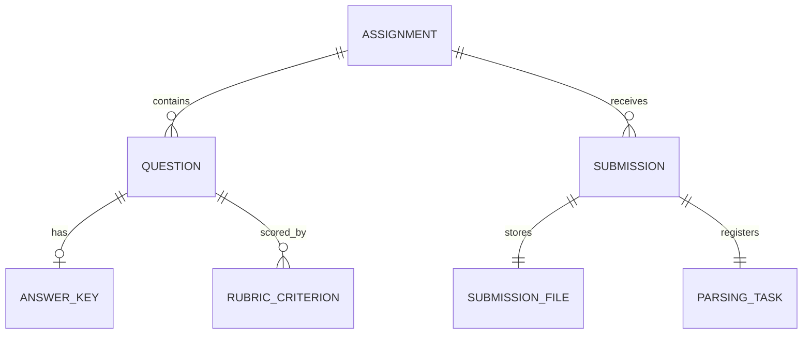

# 架构与模块边界

慧批云端采用 src 布局的模块化单体。当前已实现教师作业管理和学生作业提交闭环；OCR、AI 批改、队列 Worker 和用户权限仍未实现。

## 分层职责

- `api/v1`：HTTP 路由、请求校验、响应结构和错误码。
- `core`：环境配置、日志及跨模块基础能力，不包含教学业务规则。
- `modules/assignments`：作业、题目、人工答案、评分细则和作业发布校验。
- `modules/submissions`：模拟学生标识校验、文件检查、提交编排、提交查询和待解析任务登记。
- `infrastructure/database`：SQLAlchemy Async Engine、请求级 AsyncSession 和 ORM Base。
- `infrastructure/storage`：boto3 S3 兼容适配器。同步对象存储 I/O 在工作线程中运行，不阻塞 FastAPI 事件循环。本地 Compose 使用 PGSTY SILO 社区分支，兼容 MinIO S3 API。
- `modules/parsing`、`grading`、`copilot`、`review`、`infrastructure/llm`、`messaging`、`retrieval`、`workers`：未来模块边界，目前没有相关业务实现。
- `migrations`：Alembic 版本迁移。应用启动时不会调用 `create_all`。

路由负责 HTTP 输入输出；领域服务组织用例和事务边界；Repository 执行本模块所需的数据库查询；ORM 模型定义可由数据库直接保证的约束。当前没有通用 Repository 框架或微服务拆分。

## 数据关系

一份作业可以接收多份提交。唯一约束 `(assignment_id, student_ref)` 限定一个模拟学生对同一作业只成功提交一次。每份提交恰好关联一份原始文件元数据和一条解析任务记录。外键使用级联删除，使删除提交或作业时数据库元数据保持完整。

`SubmissionFile` 保存 bucket、由服务端生成的 `object_key`、安全处理后的文件名、MIME 类型、字节数和 SHA-256。文件二进制只存 MinIO，不存 PostgreSQL。解析任务当前只写 `pending`；没有 Worker，因此不表示它已排队或正在执行。

## 上传校验与数据流

上传端点要求 multipart 字段 `student_ref` 和一个 `file`。学生标识只接受有限 ASCII 字符格式，不承载认证或授权含义。文件上限由 `MAX_UPLOAD_SIZE_BYTES` 控制，默认 20 MiB。文件扩展名、声明的 MIME 类型和 PDF/JPEG/PNG 签名必须一致；文件名只作为元数据保存，路径部分会被剥离。

ASGI 中间件先检查上传请求的 `Content-Length`，并在无长度头时限制实际 multipart 请求体总量为文件配置上限加 64 KiB 表单开销，避免 Starlette 解析阶段先无界落盘。应用再以 64 KiB 块读取上传文件，写入最大 1 MiB 内存阈值的临时文件，超出部分由临时文件落盘。读取过程累计文件字节数并计算 SHA-256。boto3 的上传、下载和删除操作通过 `asyncio.to_thread` 执行。文件下载端点从 MinIO 取出流，再以 64 KiB 块返回；它不会返回永久公开对象 URL。

上传的执行顺序如下：

1. 检查作业存在且已发布，并验证文件名、大小、声明类型和文件签名。
2. 生成提交 UUID、文件 UUID 和对象 Key。
3. 将原始文件写入 MinIO。
4. 在一个 PostgreSQL 事务内锁定并复核作业状态，写入 `Submission`、`SubmissionFile` 和 `ParsingTask(pending)`。
5. 事务提交后返回记录。

对象 Key 的生产格式是 `assignments/{assignment_id}/submissions/{submission_id}/{file_id}`。路径完全由服务端 UUID 生成，不含用户文件名。集成测试使用独立测试存储桶和 `tests/{随机值}/` 前缀。

对象存储与 PostgreSQL 不共享事务。如果对象上传失败，不会写入提交记录。如果对象写入后数据库事务失败，服务会尝试删除对象，并只记录 Key 与异常类型。补偿删除尽力而为：进程若在对象成功写入后、数据库写入前崩溃，仍会留下孤立对象。未来需要按数据库元数据与存储清单定期对账和清理；当前没有分布式事务或自动清理器。

## 并发与完整性

每个 HTTP 请求通过 AsyncSession 工厂创建独立 Session；进程级 Engine 和 Session 工厂共享，Session 实例不跨请求共享。提交记录、文件元数据和任务使用 `session.begin()` 处于同一数据库事务，失败时整体回滚。

业务层负责“作业已发布”“大小不超过配置”“文件类型与签名匹配”等跨字段或外部系统规则。数据库负责外键、唯一键、非空、正字节数、状态取值和基础格式长度等最终约束。同一学生的并发上传可能都先完成对象上传，但唯一约束只允许一条提交元数据；失败请求会尝试删除自己的唯一 Key。

对作业行使用 PostgreSQL 锁，避免上传对象期间作业状态改变后仍写入提交。文件校验与对象上传发生在锁事务之外，避免把慢 I/O 放在数据库事务里；最终写记录前仍会在事务内重新读取并锁定作业行。

## API、安全与可用性边界

提交与文件查询 API 没有登录、RBAC、学生身份认证、作业归属检查或租户隔离。`student_ref` 可以由调用方任意填写，只用于本地测试唯一性。这些 API 只能在本地或受控环境运行，不能直接作为公网安全接口。

作业与提交 ID 使用 UUID，但 UUID 不代表授权。数据库故障映射为不泄露内部细节的 500/503；MinIO 故障返回通用 503。`GET /api/v1/health` 仍是存活探针，不检查 PostgreSQL 或 MinIO 是否就绪。

存储桶默认私有，`scripts/init_minio_bucket.py` 会创建缺失的本地 bucket 并设置 private ACL。凭据经环境变量读取，`.env.example` 中的值只是本地示例。原始文件和对象存储凭据不会写入日志。下载响应提供内容类型、附件文件名、长度和 `no-store` 缓存控制。下载前复制数据库元数据并关闭只读事务，再从对象存储取流，避免网络传输期间占用 PostgreSQL 连接。若对象流在 HTTP 响应开始后中断，服务不能再改写状态码；客户端会收到失败或不完整的流，本轮没有实现断点续传。

## 本地与 CI 数据隔离

Compose 的 PostgreSQL 服务和已有 `postgres_data` 卷不变。本轮只增加独立 `minio_data` 卷，并把 MinIO 管理端口绑定到回环地址。集成测试需要名称以 `_test` 结尾的 PostgreSQL 数据库；测试拒绝连接远端 MinIO，只使用单独的 `MINIO_TEST_BUCKET` 和随机对象 Key 前缀，并逐一删除自己生成的对象，不删除测试桶或开发数据卷。

CI 使用 PostgreSQL 16 和单独启动的 PGSTY SILO 容器，按真实 S3 API 执行对象读写集成测试。检查包括 Ruff、空数据库迁移、Alembic 模型一致性和 pytest。外部依赖不可达或对象存储未配置时，相关集成测试不能报告为通过。
