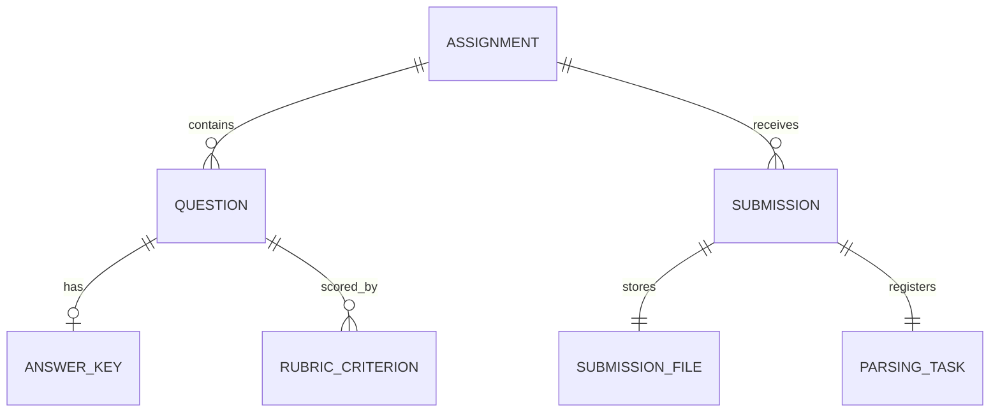

# 架构与模块边界

慧批云端采用 src 布局的模块化单体。P1-A、P1-B 已合并到 `main`；当前 P2-A 分支增加数据库驱动的解析任务运行框架。真实 OCR/MinerU、解析结果、自动批改和用户权限仍未实现。

## 模块职责

- `api/v1`：HTTP 路由、请求校验、响应结构和错误码。
- `core`：环境配置和日志。
- `modules/assignments`：作业、题目、人工答案、评分细则和发布校验。
- `modules/submissions`：模拟学生标识校验、文件检查、提交编排、提交查询和原始文件元数据。
- `modules/parsing`：解析任务状态、状态迁移规则、PostgreSQL repository、错误分类、重试时间策略、状态查询 Schema 与 ParserExecutor 协议。
- `workers`：独立于 FastAPI 的解析任务轮询进程，管理领取、解析调用、heartbeat、结果提交和受控退出。
- `infrastructure/database`：共享 Engine 工厂与按请求/操作创建的 AsyncSession；Alembic 管理结构，应用启动不会调用 `create_all`。
- `infrastructure/storage`：boto3 S3 兼容适配器。本地对象存储使用 PGSTY SILO。
- `migrations`：按版本演进的 PostgreSQL Schema。

路由负责 HTTP 输入输出；领域服务组织用例；Repository 负责具体数据库查询。当前没有通用 Repository 框架、微服务、Celery、RabbitMQ 或 Redis。

## 数据关系



同一 `Submission` 有一份 `SubmissionFile` 元数据与唯一的 `ParsingTask`。提交、对象定位信息和初始 `pending` 任务在一个 PostgreSQL 事务内写入。原文件放在私有 S3 兼容存储，数据库只保存 bucket、服务端生成的 `object_key`、MIME、大小和 SHA-256。

## 任务状态与执行边界

允许的主要状态迁移：

```text
pending ──claim──> running ──success──> succeeded
                       ├──temporary failure──> retry_wait ──due claim──> running
                       └──permanent/exhausted──> failed
```

`running` 任务的 `lease_token` 与 `lease_expires_at` 必须同时存在；其他状态不得保留 lease。`retry_wait` 必须有 `next_run_at`。成功和最终失败必须有 `finished_at`。数据库约束防止不合法字段组合；Service/Repository 根据错误类型、尝试次数和当前 lease 选择合法迁移。

`claim_next_task()` 在短事务中先用 `FOR UPDATE SKIP LOCKED` 选出最早的到期任务，生成唯一 token 并增加尝试次数。数据库在写入领取状态时用 `clock_timestamp()` 计算新 lease 截止时间，因此扫描和锁定工作不会提前消耗大部分租约。事务提交后行锁释放；Parser 执行在事务之外。长任务按 heartbeat 间隔续租。完成和续租使用带 token、状态和数据库当前时间条件的 `UPDATE`。失败也在一个条件 `UPDATE` 中检查租约并按尝试次数选择重试状态。PostgreSQL 在 `READ COMMITTED` 下等待行锁后会重新检查 `UPDATE` 的条件；条件中的 `clock_timestamp()` 在更新时判断，不会使用锁等待前读到的旧时间。过期任务可由后续 Worker 领取；过期且达到上限的任务以固定安全错误摘要转为 `failed`。

每次领取、续租、完成或失败更新都创建独立 AsyncSession。请求期间不共享 Session 实例。Engine/Session 工厂是进程级资源；SQLAlchemy Session 不跨请求或 Worker 操作共享。Repository 使用上下文管理器提交或回滚事务，并关闭 Session。租约判断默认使用 PostgreSQL `clock_timestamp()`，所有 Worker 共享数据库时钟；测试可显式注入固定 UTC 时间。

重试错误使用数据库保存的 `next_run_at` 和有上限的指数退避，不在 Worker 中长时间等待某一任务。执行模型是 At Least Once。lease 只能围住 PostgreSQL 状态提交，不能撤销过期 Worker 已经产生的外部副作用；未来解析产物必须按任务或提交版本幂等写入。

当前没有真实解析器。Worker CLI 要求 `PARSING_EXECUTOR=module.path:factory`，否则拒绝启动。ParserExecutor 接收不可变的任务与文件元数据；执行器必须在任务内等待所有工作完成，并响应协程取消。当前 Worker 只支持协作式异步解析；不得在事件循环中运行无法中断的同步调用，也不能把 `asyncio.to_thread()` 当作可强制终止的隔离边界。未来若 MinerU 或原生库不能合作取消，P2-B 必须把它放入可终止并回收的子进程。仓库没有生产 FakeParser；Fake executor 仅写在测试中。

## 上传和对象一致性

上传时先校验作业、文件名、文件大小、扩展名、声明类型和文件签名，分块读取文件并计算 SHA-256，再将对象写入私有存储。随后在 PostgreSQL 事务内锁定并复核作业状态、写入 `Submission`、`SubmissionFile` 和 `ParsingTask(pending)`。若上传失败，不写提交记录；若数据库事务失败，会尝试删除已上传对象。数据库与对象存储没有共享事务，因此进程崩溃或 COMMIT 结果不确定仍可能留下孤立对象。未来应定期对账清理。

## 安全与可用性边界

`student_ref` 不是认证身份。作业提交、文件下载和任务状态查询没有登录、RBAC、归属校验或租户隔离，只能在本地或受控环境使用。任务状态 API 不返回 `lease_token`、对象 Key、文件内容、堆栈或原始异常信息；执行错误只保存固定的错误码和短摘要。`GET /api/v1/health` 是存活探针，不检查 PostgreSQL 或对象存储就绪状态。数据库连接故障由 API 统一返回安全错误响应。

## 并发与故障语义

PostgreSQL 是当前任务队列。行锁与 `SKIP LOCKED` 避免 Worker 等待同一行；lease token 和条件更新让旧 Worker 无法覆盖新执行的状态。租约到期不证明旧进程已停止，因此系统不承诺 Exactly Once。Worker 在 SIGINT/SIGTERM 后停止领取任务，并在 `PARSING_SHUTDOWN_GRACE_SECONDS` 内等待当前执行。之后它请求协程取消，并最多等待 `PARSING_CANCEL_GRACE_SECONDS`。若 Parser 不响应取消，Worker 记录任务 ID 后以退出码 70 直接结束进程，让租约过期后恢复任务。该故障退出不会运行 Python 清理钩子，也不能回滚已产生的外部副作用；它只适用于无法通过协程协议安全停止执行的情况。

`PARSING_EXECUTION_TIMEOUT_SECONDS` 限制一次解析的总运行时长，和短期租约时长是不同设置。超时时 Worker 请求协程取消；只有 Parser 响应取消后，Worker 才记录可重试超时。这个期限依赖事件循环能继续运行，不能中断永久阻塞的同步代码或取消已开始运行的线程。无法协作取消的解析器必须由 P2-B 放入受监督的子进程。心跳数据库错误时，Worker 取消当前解析；若取消成功，它不写 `succeeded`，保留当前运行记录并继续轮询，让租约到期后重新领取。明确返回“租约丢失”时也取消 Parser，但不提交任何结果。领取阶段的数据库错误会延迟一个轮询周期后重试；未预期的程序错误会在清理当前协程后向外传播。

Heartbeat 已确认本轮 Task 的状态和租约。它不保证解析产物只写一次。任务可能在外部副作用完成后、状态提交前失去租约并被重跑。P2-B 需要为解析产物定义稳定幂等键与重复写入策略；当前没有实现这一机制。

## 配置、迁移和验证

数据库、对象存储、任务尝试次数、lease、heartbeat、执行时限、关闭宽限和退避参数都从环境变量读取。`PARSING_MAX_ATTEMPTS` 的值在创建任务时保存到记录，以便后续配置变化不改写已有任务的重试策略。Alembic 新增迁移只增加执行字段并保留既有 `pending` 行，旧记录按默认最大尝试次数 3 继续等待处理。

集成测试要求真实 PostgreSQL；P1-B 文件集成测试还需要本地 S3 兼容服务。CI 使用 PostgreSQL 16 与 PGSTY SILO。测试仅操作 `_test` 数据库和测试对象前缀，不清空开发数据卷。
